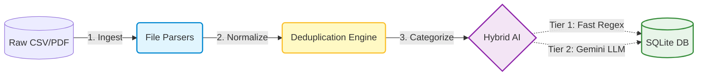
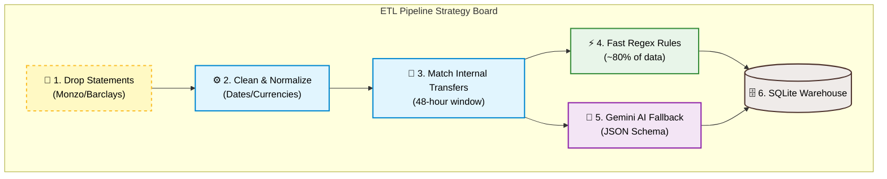
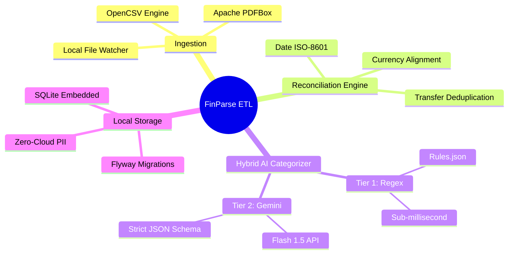

# 📊 FinParse ETL 
*(Formerly StatementProcessor)*

**An enterprise-grade Java pipeline for automated extraction, transformation, and AI-driven categorization of financial statements.**

[](https://github.com/amalsebastian7/StatementProcessorJava)
[](https://oracle.com/java)
[](https://maven.apache.org/)
[](https://sqlite.org/)
[](https://ai.google.dev/)

</div>

---

## 📖 Overview
FinParse ETL is a modular, privacy-first data engineering project designed to ingest raw bank statements (CSV and PDF) from local file systems or NAS, parse the unstructured financial data, and process it for deep personal analytics. 

Instead of relying on fragile manual data entry or paying for cloud budgeting apps that sell your data, this pipeline runs **100% locally**. It utilizes a hybrid **Rule-Based & AI-Enriched Categorization Engine** alongside a deterministic deduplication system to accurately track internal transfers, clean historical data, and securely store it for querying.

---

## How It Works (High-Level Pipeline)



## ✨ Core Architecture & Features

* 🗂️ **Multi-Format Ingestion:** Automated parsing of complex CSV layouts (via OpenCSV) and unstructured legacy PDFs (via Apache PDFBox).
* 🧮 **Deterministic Deduplication:** Rule-based SQL/Java matching engine that automatically detects and nullifies internal transfers between user accounts within a 48-hour time window.
* 🧠 **Hybrid Categorization Pipeline:**
* *Tier 1 (Zero-Cost):* Sub-millisecond Regex matching for ~80% of known merchants (e.g., Tesco, Netflix).
* *Tier 2 (AI-Enriched):* Batch LLM processing via native HTTP clients to categorize ambiguous transactions using strict JSON schemas.

* 🔐 **Security First:** Strict separation of concerns, `.properties`/environment variable credential management, and dummy data for isolated testing. Raw financial data never leaves the host machine.

## 🛠️ Tech Stack

| Category | Technologies Used |
| --- | --- |
| **Core Language** | Java 21 (Modular separation of concerns) |
| **Build & Dependencies** | Maven |
| **Data Extraction** | OpenCSV, Apache PDFBox |
| **Database Layer** | SQLite JDBC (Zero-config embedded DB for local analytics), Flyway |
| **AI Integration** | Native Java HTTP/JSON parsing (Jackson) for Google Gemini API |
| **Testing** | JUnit 5, AssertJ, WireMock, Testcontainers |


## 📂 Project Documentation Hub

This repository maintains a comprehensive architecture and product documentation matrix. *Click on any document link to view the specific file.*

###  Phase 1: Product Strategy & UX

| Document | Purpose | Location |
| --- | --- | --- |
| **Product Requirements Document** | What are we building, for whom, and why? | [`docs/product/prd.md`](https://www.google.com/search?q=./docs/product/prd.md) |
| **Product Vision & Roadmap** | Scope of MVP and future iterations | [`docs/product/vision-roadmap.md`](https://www.google.com/search?q=./docs/product/vision-roadmap.md) |
| **User Flow & Wireframes** | Application navigation and state behavior | [`docs/design/user-flows.md`](https://www.google.com/search?q=./docs/design/user-flows.md) |

###  Phase 2: Architecture & Engineering

| Document | Purpose | Location |
| --- | --- | --- |
| **System Architecture** | Pipeline flow, service integrations, and data ingestion | [`docs/engineering/architecture.md`](https://www.google.com/search?q=./docs/engineering/architecture.md) |
| **Detailed Pipeline Flow** | Granular step-by-step ETL execution mapping | [`docs/engineering/detailed-pipeline.md`](https://www.google.com/search?q=./docs/engineering/detailed-pipeline.md) |
| **UML Class Diagram** | Object-Oriented design and design patterns | [`docs/engineering/class-diagram.md`](https://www.google.com/search?q=./docs/engineering/class-diagram.md) |
| **Data Model & Schema** | SQLite entities, relationships, constraints, and migrations | [`docs/engineering/database.md`](https://www.google.com/search?q=./docs/engineering/database.md) |
| **API & AI Specification** | LLM endpoints, prompt schemas, requests, and responses | [`docs/engineering/api.md`](https://www.google.com/search?q=./docs/engineering/api.md) |
| **Security & Threat Model** | Credential handling and local-first data protection | [`docs/engineering/security.md`](https://www.google.com/search?q=./docs/engineering/security.md) |
| **Tech Decision Records (ADRs)** | Why we chose Java, specific parsers, and hybrid AI | [`docs/engineering/adrs.md`](https://www.google.com/search?q=./docs/engineering/adrs.md) |

### Phase 3: QA, Testing & Ops

| Document | Purpose | Location |
| --- | --- | --- |
| **Testing Strategy** | Unit, integration, and E2E testing using Dummy Statements | [`docs/qa/testing-strategy.md`](https://www.google.com/search?q=./docs/qa/testing-strategy.md) |
| **Deployment & Ops** | Execution instructions, cron-jobs, and file-watcher setups | [`docs/ops/deployment.md`](https://www.google.com/search?q=./docs/ops/deployment.md) |


##  Repository Structure

```text
statement-processor/
├── pom.xml
├── .env.example
├── docs/                        # Project Documentation Hub (See index above)
├── config/                      # App settings & category mappings
└── src/
    ├── main/java/com/finparse/
    │   ├── ingestion/           # Reading raw files (CSV/PDF)
    │   ├── model/               # Domain Entities (Transaction, Account)
    │   ├── engine/              # Deduplication & Normalization
    │   ├── enrichment/          # Rule-based & LLM categorization
    │   └── storage/             # SQLite / CSV Output
    └── test/resources/          # Dummy/Sanitized Statements for Testing

```

## 📌 Pipeline Strategy Board



---

## 🗺️ Project Mindmap


---