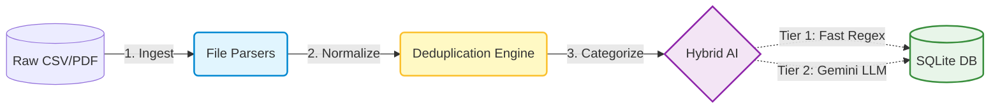
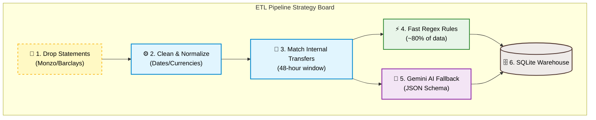
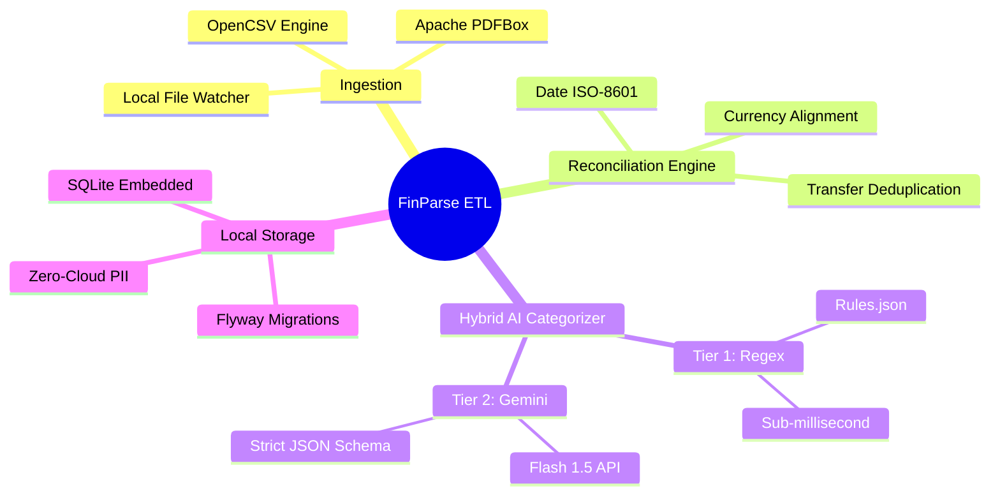

# 📊 FinParse ETL 
*(Formerly StatementProcessor)*

**An enterprise-grade Java pipeline for automated extraction, transformation, and AI-driven categorization of financial statements.**

[](https://github.com/amalsebastian7/StatementProcessorJava)
[](https://oracle.com/java)
[](https://maven.apache.org/)
[](https://sqlite.org/)
[](https://ai.google.dev/)

</div>

---

## 📖 Overview
FinParse ETL is a modular, privacy-first data engineering project designed to ingest raw bank statements (CSV and PDF) from local file systems or NAS, parse the unstructured financial data, and process it for deep personal analytics. 

Instead of relying on fragile manual data entry or paying for cloud budgeting apps that sell your data, this pipeline runs **100% locally**. It utilizes a hybrid **Rule-Based & AI-Enriched Categorization Engine** alongside a deterministic deduplication system to accurately track internal transfers, clean historical data, and securely store it for querying.

---

## How It Works (High-Level Pipeline)



## ✨ Core Architecture & Features

* 🗂️ **Multi-Format Ingestion:** Automated parsing of complex CSV layouts (via OpenCSV) and unstructured legacy PDFs (via Apache PDFBox).
* 🧮 **Deterministic Deduplication:** Rule-based SQL/Java matching engine that automatically detects and nullifies internal transfers between user accounts within a 48-hour time window.
* 🧠 **Hybrid Categorization Pipeline:**
* *Tier 1 (Zero-Cost):* Sub-millisecond Regex matching for ~80% of known merchants (e.g., Tesco, Netflix).
* *Tier 2 (AI-Enriched):* Batch LLM processing via native HTTP clients to categorize ambiguous transactions using strict JSON schemas.

* 🔐 **Security First:** Strict separation of concerns, `.properties`/environment variable credential management, and dummy data for isolated testing. Raw financial data never leaves the host machine.

## 🛠️ Tech Stack

| Category | Technologies Used |
| --- | --- |
| **Core Language** | Java 21 (Modular separation of concerns) |
| **Build & Dependencies** | Maven |
| **Data Extraction** | OpenCSV, Apache PDFBox |
| **Database Layer** | SQLite JDBC (Zero-config embedded DB for local analytics), Flyway |
| **AI Integration** | Native Java HTTP/JSON parsing (Jackson) for Google Gemini API |
| **Testing** | JUnit 5, AssertJ, WireMock, Testcontainers |


## 📌 Pipeline Strategy Board



---

## 🗺️ Project Mindmap


## 📂 Project Documentation Hub

This repository maintains a comprehensive architecture and product documentation matrix. *Click on any document link to view the specific file.*

<details>
<summary><b>📋 Click to expand: Application Master Specification Taxonomy</b></summary>

This project's documentation adheres to the following enterprise specification standard:

```text
APPLICATION MASTER SPECIFICATION
│
├── 01 Product                  # Strategic alignment and user needs
│   ├── Vision & Problem        # Why this pipeline exists and MVP scope
│   └── Requirements (PRD)      # User stories and BDD acceptance criteria
│
├── 02 Architecture             # High-level system design
│   ├── System Architecture     # C4 Model container diagrams
│   ├── Detailed Pipeline       # Granular step-by-step ETL execution mapping
│   ├── Class Diagrams          # Object-oriented domain design (UML)
│   └── ADRs                    # Architecture Decision Records (Historical log)
│
├── 03 Data                     # Persistence and data integrity
│   ├── Database Schema         # SQLite DDL and entity relationships
│   └── Data Lifecycle          # Sanitization and PII retention policies
│
├── 04 APIs                     # External system interactions
│   ├── Integration Contracts   # LLM endpoints and JSON schema enforcement
│   └── Authentication          # API key header management
│
├── 05 Security                 # Threat mitigation
│   ├── Threat Model            # STRIDE methodology and local-first boundaries
│   └── Privacy                 # Pre-LLM data redaction and zero-cloud PII
│
├── 06 Engineering              # Development standards
│   ├── Repository Structure    # Modular separation of concerns
│   └── Testing Strategy        # Unit/Integration tiers using Dummy Data
│
└── 07 Operations               # Running the software
    ├── Deployment              # Native OS execution instructions
    └── Automation              # Systemd/Cron configuration for file watching
```

---
