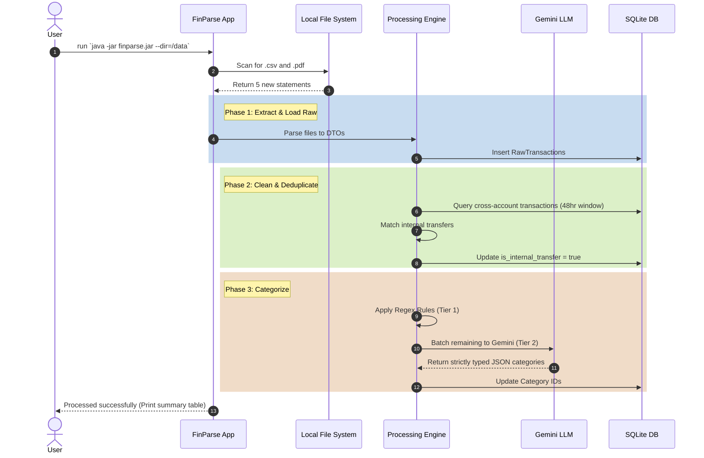

# User Flow & Execution Diagrams

## 1. System Execution Sequence
Since FinParse is a backend ETL pipeline, the UX is determined by terminal execution and log output.

## 2. Exception Handling Flow
*   **Missing API Key:** If `.env` lacks `GEMINI_API_KEY`, the pipeline completes Tier 1 (Regex) and gracefully skips Tier 2, marking remaining as `UNCATEGORIZED`.
*   **Database Lock:** If SQLite is locked (e.g., user has it open in DB Browser), CLI immediately throws a fast-fail error to prevent data corruption.
