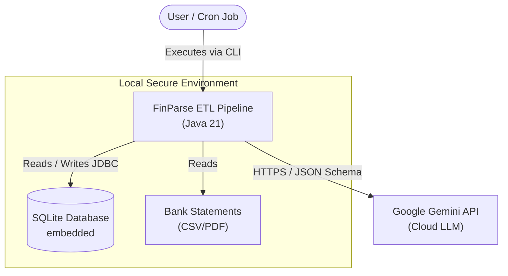

# 🏛️ System Architecture

## 1. Architectural Style
FinParse ETL utilizes a **Modular Monolith** architecture based on the **Ports and Adapters (Hexagonal)** pattern. This ensures the core domain logic (deduplication, math) is entirely decoupled from external dependencies (Google APIs, SQLite).

## 2. C4 Model - Container Diagram

## 3. Core Component Breakdown

### 3.1 Ingestion Layer (`com.finparse.ingestion`)
*   **`FileWatcherService`**: Manages the ingestion queue and tracks processed file hashes to prevent double-ingestion.
*   **`StatementParser` (Interface)**: 
    *   `MonzoCsvAdapter`
    *   `BarclaysPdfAdapter`
    *   *Design Pattern:* Strategy Pattern. Allows dropping in new bank adapters without touching core code.

### 3.2 Core Engine (`com.finparse.engine`)
*   **`NormalizationService`**: Converts all currencies to a base currency (e.g., GBP) and normalizes dates to ISO-8601.
*   **`TransferReconciliationEngine`**: Core algorithmic component. Runs a sliding window calculation (O(N log N)) to match bipartite graphs of transactions (sender -> receiver).

### 3.3 Enrichment Layer (`com.finparse.enrichment`)
*   **`Tier1RegexCategorizer`**: Loads `rules.json`. Highly optimized `java.util.regex.Pattern` matching.
*   **`Tier2LlmCategorizer`**: Uses standard `java.net.http.HttpClient`. Implements exponential backoff and circuit breaking using resilience4j concepts.
