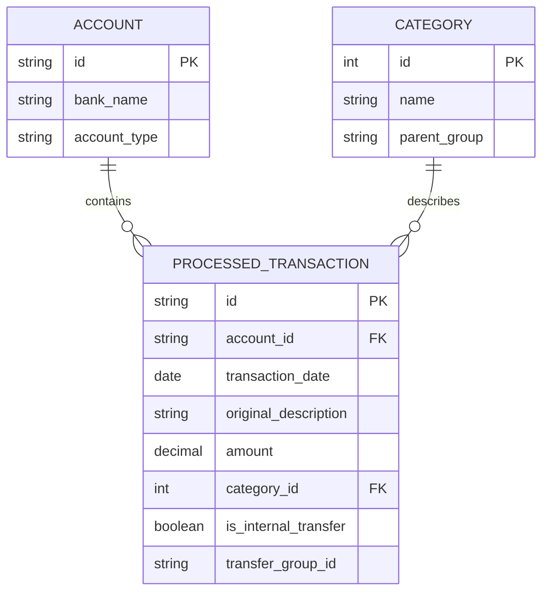

# 🗄️ Database Schema & Data Model

## 1. Storage Strategy
FinParse uses an embedded **SQLite** database. Migrations will be managed by **Flyway** (e.g., `V1__Initial_Schema.sql`) to ensure schema version control.

## 2. Entity Relationship Diagram (ERD)



## 3. SQL Data Definition Language (DDL)

```sql
-- V1__Initial_Schema.sql

CREATE TABLE accounts (
    id TEXT PRIMARY KEY,
    bank_name TEXT NOT NULL,
    account_type TEXT NOT NULL,
    created_at TIMESTAMP DEFAULT CURRENT_TIMESTAMP
);

CREATE TABLE categories (
    id INTEGER PRIMARY KEY AUTOINCREMENT,
    name TEXT NOT NULL UNIQUE,
    parent_group TEXT NOT NULL, -- e.g., 'Fixed Costs', 'Discretionary'
    is_system BOOLEAN DEFAULT 0 -- 1 for protected categories like 'Transfer'
);

CREATE TABLE processed_transactions (
    id TEXT PRIMARY KEY,
    account_id TEXT NOT NULL,
    transaction_date DATE NOT NULL,
    original_description TEXT NOT NULL,
    clean_description TEXT,
    amount DECIMAL(10, 2) NOT NULL,
    category_id INTEGER,
    is_internal_transfer BOOLEAN DEFAULT 0,
    transfer_group_id TEXT,
    enrichment_source TEXT, -- 'REGEX', 'LLM', 'MANUAL'
    created_at TIMESTAMP DEFAULT CURRENT_TIMESTAMP,
    FOREIGN KEY (account_id) REFERENCES accounts(id),
    FOREIGN KEY (category_id) REFERENCES categories(id)
);

-- Optimization for the Reconciliation Engine
CREATE INDEX idx_txn_date_amount ON processed_transactions(transaction_date, amount);
```
